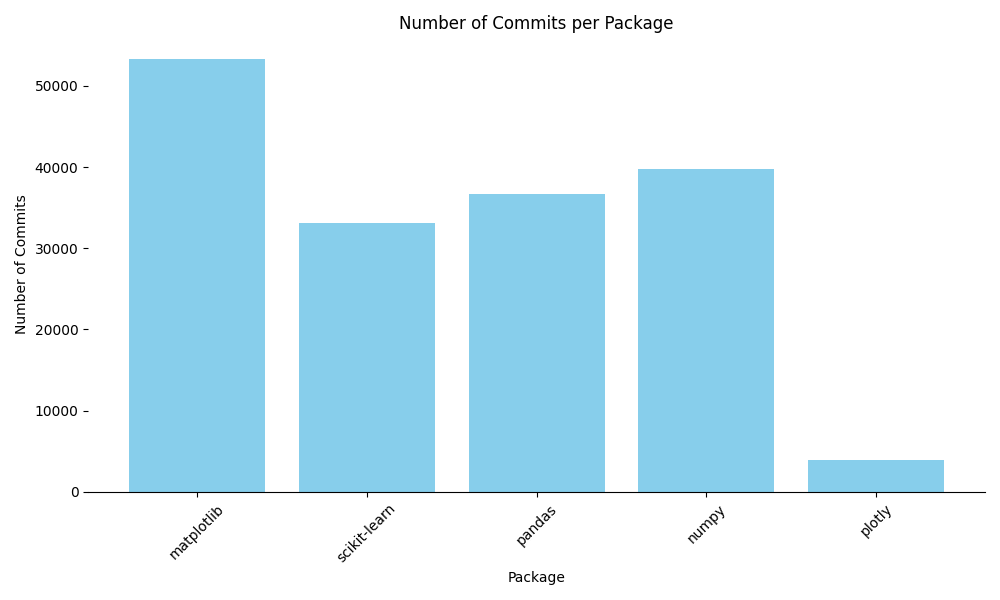
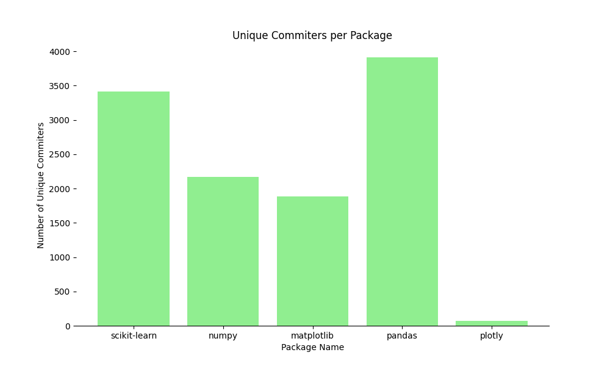
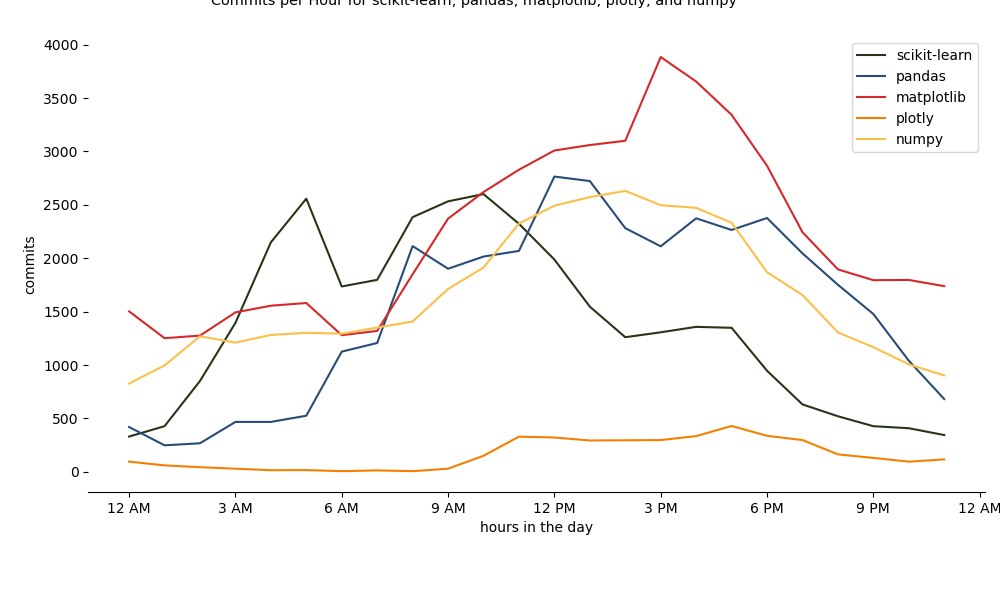
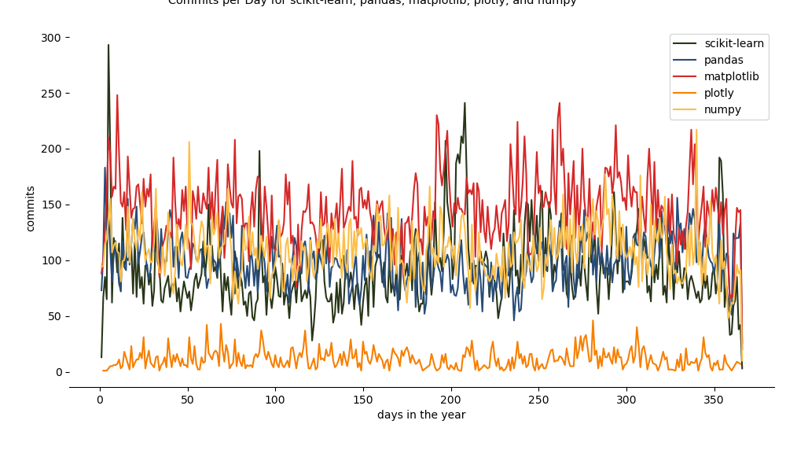
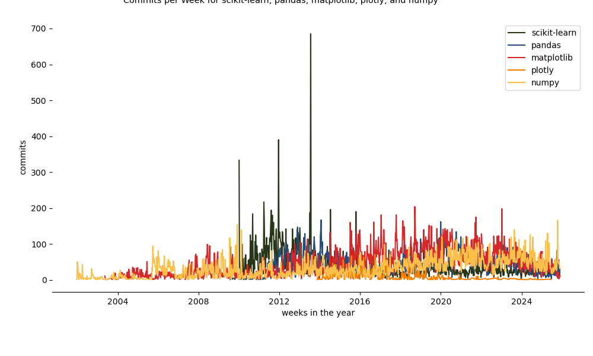
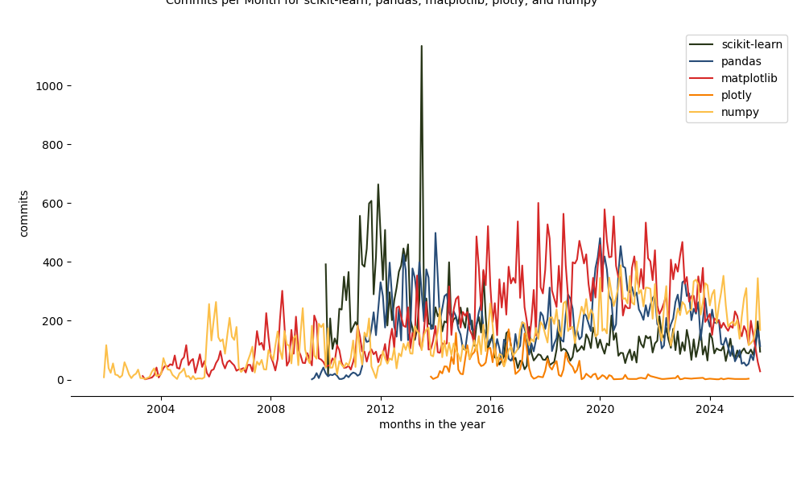
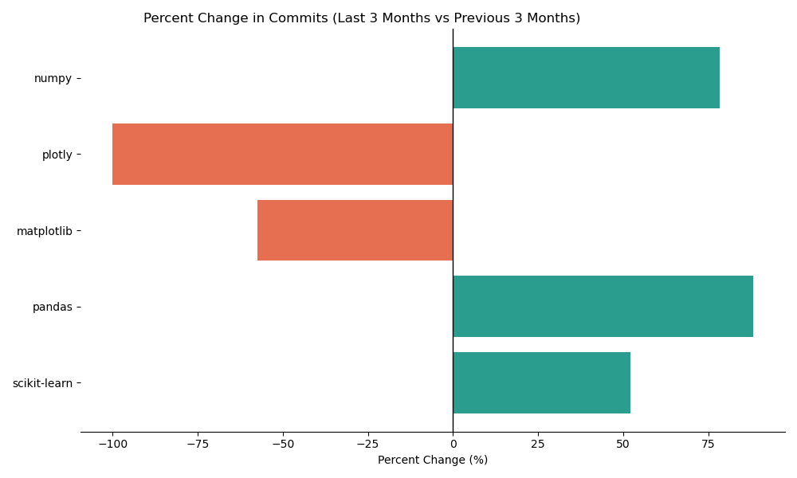
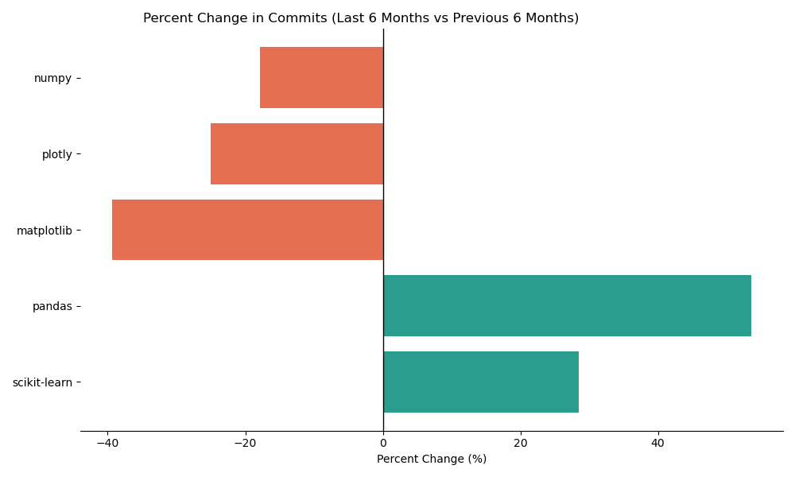

## Carissa Chen and Kayla Kim

## Data Source

**Authenticated GitHub API**
- https://api.github.com/repos/{package name}/{package name}/commits
- packages: scikit-learn, pandas, matplotlib, plotly, numpy

## Challenges / Obstacles

<!-- - visualization challenges: difficulty generalizing reusable code for graphs using matplotlib for all packages
- query specifications: syntax specifications not in prior knowledge of developers, learned through external sources on internet 
- Used duckdb to help with saving the data into a database to query more easily -->

For visualization challenges, we had difficulty generalizing reusable code for graphs using matplotlib for all packages. For query specifications, the syntax specifications were not in prior knowledge of developers. With these challenges, we learned through external sources on internet and tried to use familiar tactics, like duckdb to help with saving the data into a database to query more easily.

## Analysis

Being the 5 major Python data-science packages, commit trends over the past three and six months show distinct differences in development momentum. Pandas demonstrates the strongest recent period of growth with an 88% increase in commits over the past three months and a 54% increase over the past six months. This suggests an active development and maintenance of the package. Numpy also displays a rapid growth of 78% over the past three months, but a decline of -18% over the past six months, implying that the growth is very new and release event motivated rather than long-term. Scikit-learn also demonstrates the steady growth trend with 52% growth over the past three months and 28% growth over the past six months, which is typical for normal maintenance and development post-prototype. On the other hand, Matplotlib shows great decline with -57% growth in the past three months and -39% growth in the past six months. This is consistent with the fact that the package is maturing and in no immediate need for updates or new features; it's stabilizing. Plotly has the most lack of growth with -100% growth in the past three months, which indicates either private or slowing development in the repository. Commit counts alone do not indicate development health. Our analysis also considers contributor factors and timing patterns to distinguish active maintenance from older packages. 

## Plot / Visualization

### total commits per package

### time charts

### percent changes in packages

#### three month periods

#### six month periods

## GitHub Repository to Code
https://github.com/jac7az/CaKa-dp3-Code
